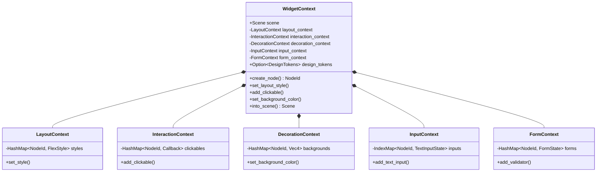

# ADR 0014: Flattened Widget Context

**Status:** Accepted

**Date:** 2026-01-22

**Deciders:** Architecture Team

## Context

The widget building process in Arthropod involves multiple distinct systems: layout, input handling, form validation, interaction (clicks/hovers), and visual decoration.

Historically, complex widget systems often use:
1.  **Multiple Context Arguments**: Passing `LayoutContext`, `InputContext`, etc., separately to every `build()` method.
2.  **Facade Pattern**: A `WidgetContext` that delegates to hidden sub-systems via complex indirection.
3.  **Trait Objects**: Storing context parts as `Box<dyn Context>`, which erases types and prevents direct field access.

The previous iteration of the widget system attempted to abstract these subsystems, but this led to:
-   Boilerplate when accessing common features (e.g., `ctx.layout().set_style(...)` vs `ctx.set_style(...)`).
-   Difficulty in maintaining the facade when sub-systems evolved.
-   Ambiguity about where state should live (in the widget vs in the context).

We need a context architecture that is:
1.  **Ergonomic**: Common operations should be available directly on `WidgetContext`.
2.  **Explicit**: Sub-systems are clearly defined and owned by the context.
3.  **Transferable**: The accumulated state must be easily transferred to the ECS at the end of the build phase.

## Decision

We adopt a **Flattened Context Architecture** where `WidgetContext` directly owns all specialized sub-contexts as public (or crate-public) fields, and exposes a flattened API for common operations.

### Architecture Overview



### Key Components

1.  **Direct Ownership**: `WidgetContext` struct definition explicitly lists all sub-contexts.
    ```rust
    pub struct WidgetContext {
        scene: Scene,
        layout_context: LayoutContext,
        interaction_context: InteractionContext,
        decoration_context: DecorationContext,
        input_context: InputContext,
        form_context: FormContext,
        // ...
    }
    ```

2.  **Flattened API**: Common methods delegate directly to sub-contexts, reducing verbosity for widget authors.
    ```rust
    impl WidgetContext {
        // Instead of ctx.layout_context.set_style(...)
        pub fn set_layout_style(&mut self, node: NodeId, style: FlexStyle) {
            self.layout_context.set_style(node, style);
        }

        // Instead of ctx.interaction_context.add_clickable(...)
        pub fn add_clickable(&mut self, node: NodeId, cb: Callback) {
            self.interaction_context.add_clickable(node, cb);
        }
    }
    ```

3.  **Build-Time Accumulation**: The context is designed to be transient. It is created at the start of the UI build phase, accumulates state as widgets are built, and is then consumed (`into_scene()` + accessor methods) to populate the ECS.

4.  **Design Tokens Integration**: The context optionally holds `DesignTokens`, allowing widgets to resolve theme values during the build process without global state access.

## Consequences

### Positive

-   **Ergonomics**: Widget `build()` methods are cleaner and easier to read.
-   **Discoverability**: IDE autocompletion on `ctx.` reveals all available capabilities (layout, input, etc.) in one place.
-   **Simplicity**: No complex facade logic; just direct delegation or field access.
-   **Maintainability**: Adding a new sub-system involves adding a field to `WidgetContext` and exposing relevant methods, without disrupting existing widgets.

### Negative

-   **Struct Size**: `WidgetContext` becomes a large struct. However, since it's passed by reference (`&mut WidgetContext`) during the build, this is not a performance issue.
-   **Coupling**: `WidgetContext` knows about all sub-systems. This is intentional (it is the "God Object" of the build phase) but reduces modularity of the context itself.

### Compliance

-   **Layering**: `WidgetContext` resides in `widget-core` and depends on `layout-engine`, `render-engine`, etc. This respects the dependency graph.
-   **Theming**: Integrates with ADR 0009 (Three-Layer Theming) via `design_tokens` field.

## References

-   `crates/widget-core/src/context.rs`: Implementation of the flattened context.
-   ADR 0009: Three-Layer Theming Architecture.
