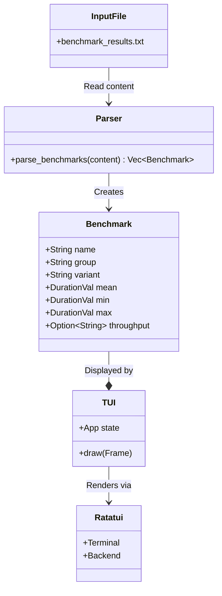

# ADR 0017: TUI-Based Benchmark Viewer

**Status:** Accepted

**Date:** 2026-05-24

**Deciders:** Performance Team, Codex

## Context

Arthropod prioritizes "Zero-Cost Reactivity" and high-performance rendering. To maintain these standards, we rely on `criterion` benchmarks (e.g., `ecs_update`, `scene_render`).

However, analyzing benchmark results currently involves:
1.  Reading raw text files or CLI output.
2.  Manually comparing "mean time" across different runs.
3.  Lacking visual aggregation for "groups" (e.g., comparing `ecs_update/10` vs `ecs_update/1000`).

The HTML reports generated by Criterion are useful but require a browser context switch and are static. Developers need a quick, terminal-native way to inspect performance metrics immediately after running `cargo bench`.

## Decision

We implement a **Terminal User Interface (TUI) Benchmark Viewer** as a binary within the `arthropod-mcp` crate.

### Architecture

The viewer uses `ratatui` for rendering and `regex` for parsing standard Criterion output logs.

### Key Components

1.  **Parser**: Extracts `time` and `throughput` stats using Regex from Criterion's stdout/file format.
2.  **Grouper**: Automatically groups benchmarks using the `group/variant` naming convention (e.g., `ecs_update/100`).
3.  **Visualization**:
    -   **Table View**: Sortable list of all benchmarks.
    -   **Detail View**: Statistical breakdown (Min/Mean/Max).
    -   **Chart View**: Bar chart comparing variants within the same group (e.g., scaling characteristics).

## Consequences

### Positive

-   **Immediate Feedback**: Developers can visualize regressions in the terminal without context switching.
-   **Comparative Analysis**: Group-based charting makes scaling issues (O(n) vs O(n^2)) visually apparent.
-   **Tool Consolidation**: leverages the `arthropod-mcp` crate, centralizing developer tools.

### Negative

-   **Dependencies**: Adds `ratatui` and `crossterm` to `arthropod-mcp` (already present for other MCP CLI features, but increases binary size).
-   **Format Coupling**: The regex parser is coupled to Criterion's specific text output format. If Criterion changes its output, the parser will break.

## References

-   `crates/arthropod-mcp/src/bin/bench-viewer.rs`: Implementation.
-   [Ratatui](https://ratatui.rs/): TUI framework used.
