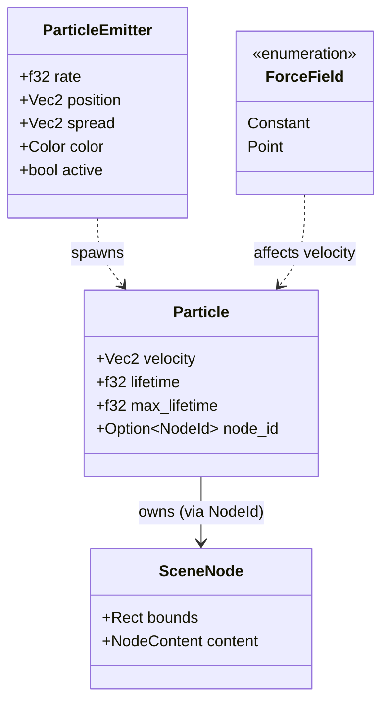

# ADR 0018: Nova Particle System

**Status:** Accepted

**Date:** 2026-01-20

**Deciders:** Architecture Team

## Context

Arthropod users need to create rich visual effects such as fire, smoke, rain, and sparks to build immersive user interfaces.

Standard UI widgets (like `Button` or `Div`) are too heavy for these use cases:
1.  **Memory Overhead**: Widgets carry full layout, event handling, and styling state.
2.  **Performance**: Layout engines (Flexbox) are O(N) or worse and not optimized for thousands of moving elements.
3.  **Physics**: Widgets lack physics properties (velocity, acceleration, lifetime).

We need a system that can simulate and render thousands of ephemeral elements efficiently while integrating with the existing `render-engine` scene graph.

## Decision

We will implement a **Physics-Based Particle System** as an experimental feature (`nova`) in the `arthropod` crate.

### Architecture

The system uses a **Hybrid ECS + Scene Graph** approach:

1.  **Logic (ECS)**: `bevy_ecs` manages particle state (physics, lifetime).
2.  **Rendering (Scene)**: `render-engine` renders the visual representation.
3.  **Synchronization**: A system syncs ECS state to Scene Nodes every frame.

### Components



### System Pipeline

The particle simulation runs in the following order within the application update loop:

1.  `update_particle_time`: Updates the global `ParticleTime` resource (dt).
2.  `emit_particles`:
    *   Accumulates time delta.
    *   Spawns new `Particle` entities in ECS.
    *   Creates corresponding `SceneNode`s in the `Scene`.
    *   Links them via `Particle.node_id`.
3.  `apply_forces`:
    *   Queries all `ForceField` entities.
    *   Modifies `Particle.velocity` based on fields (Constant, Point).
4.  `update_particles`:
    *   Integrates position (Euler: pos += vel * dt).
    *   Updates `Particle.lifetime`.
    *   **Synchronization**: Updates `SceneNode.bounds` (position) and `opacity`.
    *   **Cleanup**: Removes `SceneNode` and despawns entity when lifetime expires.

### Integration

To use the system, applications must enable the `nova` feature and register the systems:

```toml
[dependencies]
arthropod = { version = "*", features = ["nova"] }
```

```rust
use arthropod::experimental::particles::register_particles;

fn main() {
    let mut app = App::new();
    register_particles(&mut app);
    // ...
}
```

## Consequences

### Positive

*   **High Performance**: Bypasses the Layout Engine. Can handle thousands of particles.
*   **Decoupled Rendering**: Reuses `render-engine`'s efficient instanced rendering (RectInstances).
*   **Composability**: Particles live in the same `Scene` as widgets, allowing correct Z-ordering and layering.
*   **Extensibility**: New behaviors (e.g., collision) can be added as new ECS systems.

### Negative

*   **Synchronization Overhead**: Requires copying position data from ECS components to `SceneNode`s every frame.
*   **Memory Duplication**: Position is stored in both `Particle` (indirectly via integration) and `SceneNode` (`bounds`).
*   **Experimental Status**: The API is subject to breaking changes (guarded by `nova` feature).

### Risks

*   **Scene Graph Contention**: Rapidly adding/removing nodes in the Scene Graph might fragment internal storage if not optimized (currently `Scene` uses `slab` or similar generation-index arena).
*   **Thread Safety**: Synchronization requires mutable access to `Scene`, forcing serial execution of the `update_particles` system relative to other scene writers.

## References

*   `crates/arthropod/src/experimental/particles.rs` (Implementation)
*   ADR 0001: Hybrid ECS Architecture (Foundation for this approach)
