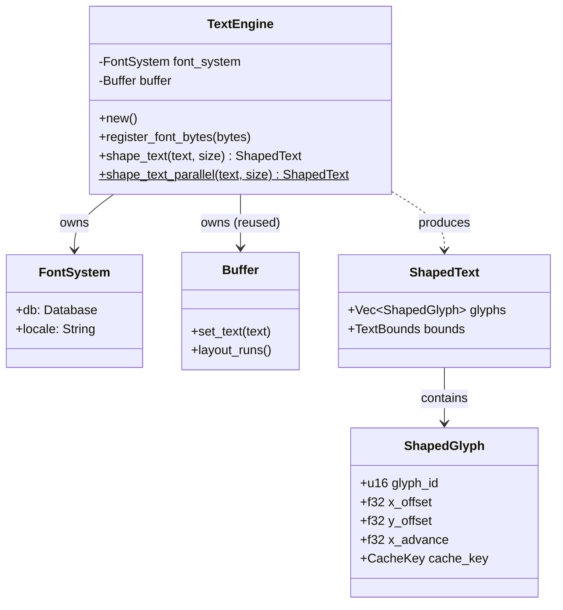

# ADR 0021: Text Engine Architecture

**Status:** Accepted

**Date:** 2026-02-07

**Deciders:** Architecture Team

## Context

High-quality text rendering is fundamental to any GUI framework. Arthropod requires a text engine that can handle:

1.  **Complex Scripts**: Bidirectional text (Arabic, Hebrew), complex shaping (Devanagari, Thai), and ligatures.
2.  **System Fonts**: Discovery and loading of fonts from the OS (Windows, macOS, Linux).
3.  **Performance**: Shaping and layout must be fast enough to run on every frame for dynamic text (or cached efficiently).
4.  **Parallelism**: Text shaping is CPU-intensive and should be parallelizable across threads.
5.  **Integration**: Must produce glyph runs compatible with the `render-engine`'s GPU pipeline.

Previous attempts using basic font rasterization (e.g., `ab_glyph` or `glyph_brush` alone) lacked sophisticated shaping capabilities required for internationalization.

## Decision

We implement a dedicated `text-engine` crate based on **`cosmic-text`**.

### Architecture

The `text-engine` serves as the single source of truth for font management and text layout. It wraps `cosmic-text` primitives to provide a simplified, thread-safe API for the rest of the framework.



### Key Components

1.  **Font Discovery**: Uses `fontdb` (via `cosmic-text`) to scan system fonts and load custom fonts.
2.  **Shaping**: Uses `rustybuzz` (HarfBuzz port) for shaping, handling complex scripts and ligatures.
3.  **Rasterization Support**: Uses `swash` for rasterizing glyphs (though actual rasterization happens in `render-engine`).
4.  **Parallel Execution**: Implements thread-local `FontSystem` pools to allow `rayon`-based parallel text shaping without lock contention.

### Parallel Shaping Strategy

Text shaping is stateless with respect to the application but stateful with respect to the `FontSystem` (which holds font data). To enable parallel shaping:

-   We maintain a **Global Font Registry** (`Arc<Mutex<Vec<Vec<u8>>>>`) for custom fonts.
-   We use **Thread-Local Storage (TLS)** to hold a `FontSystem` instance per thread.
-   When `shape_text_parallel` is called, it:
    1.  Syncs the thread-local `FontSystem` with the global registry.
    2.  Shapes the text using the local instance.
    3.  Returns `ShapedText` (which is `Send` + `Sync`).

```rust
// Simplified Parallel Logic
thread_local! {
    static FONT_SYSTEM_POOL: RefCell<FontSystem> = ...
}

pub fn shape_text_parallel(text: &str, size: f32) -> ShapedText {
    FONT_SYSTEM_POOL.with(|pool| {
        // Safe to use pool here without locking other threads
        pool.shape(text, size)
    })
}
```

## Consequences

### Positive

-   **Internationalization**: Full support for complex scripts and bidirectional text.
-   **Performance**: Reusing `Buffer` minimizes allocations. Parallel shaping scales linearly with core count.
-   **System Integration**: Native look and feel by using system fonts.
-   **Maintainability**: Decouples complex shaping logic from rendering and widget logic.

### Negative

-   **Binary Size**: `cosmic-text` and its dependencies (`rustybuzz`, `swash`) add significant size to the binary (~1-2MB).
-   **Initialization Cost**: Scanning system fonts can take time on startup (mitigated by lazy loading or limited scope).
-   **Memory Usage**: Each thread-local `FontSystem` duplicates some font metadata (though font data itself can be shared or memory-mapped).

### Risks

-   **Font Fallback**: Ensuring consistent fallback behavior across platforms can be tricky.
-   **Thread Safety**: Must ensure `FontSystem` is not accessed concurrently; TLS enforces this but requires care with `Send` bounds.

## References

-   `crates/text-engine/src/lib.rs`
-   [cosmic-text](https://github.com/pop-os/cosmic-text)
-   [rustybuzz](https://github.com/RazrFalcon/rustybuzz)
-   ADR 0020: Parallelization Strategy (depends on this)
