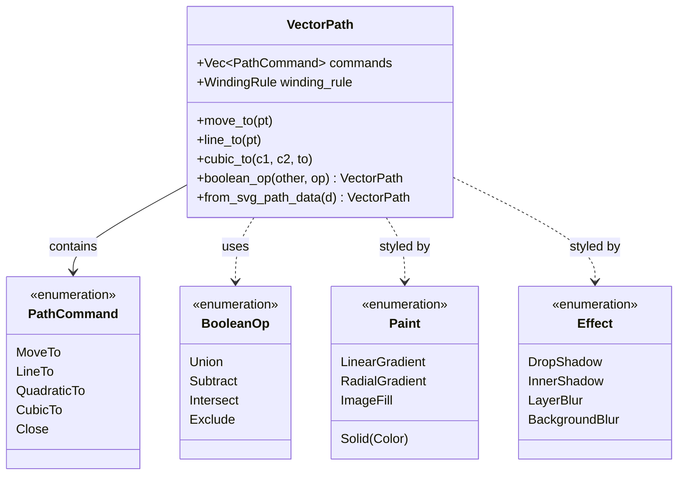

# ADR 0022: Style Engine and Vector Graphics

**Status:** Accepted

**Date:** 2026-02-07

**Deciders:** Architecture Team

## Context

Modern UI frameworks require more than just rectangles and text. Users expect:
1.  **Vector Graphics**: Scalable icons, illustrations, and complex shapes.
2.  **SVG Support**: Importing paths from standard formats.
3.  **Boolean Operations**: Combining shapes (Union, Subtract, Intersect) dynamically.
4.  **Rich Styling**: Gradients, shadows, blurs, and strokes (similar to Figma or CSS).

Previous approaches using basic `render-engine` primitives (rectangles) were insufficient for these needs. We needed a dedicated crate to handle the mathematical complexity of vector paths and styling rules.

## Decision

We implement a dedicated `style-engine` crate to provide unified styling primitives and vector path operations.

### Architecture

The `style-engine` is a pure logic crate (no GPU dependencies) that defines the data structures and algorithms for vector graphics. It sits between the high-level widget system and the low-level rendering engine.

### Key Components

1.  **Vector Path**: A resolution-independent representation of shapes using Bézier curves.
2.  **SVG Parser**: A robust parser for SVG `d` path data, supporting all standard commands.
3.  **Boolean Operations**: Uses the `geo` crate to perform constructive solid geometry (CSG) on 2D shapes (Union, Difference, Intersection, XOR).
4.  **Styling Primitives**: Defines strict types for `Paint` (gradients, images), `Stroke`, and `Effect` (shadows, blurs) to ensure consistency across the framework.

### Path Flattening and Tesselation

The `style-engine` handles the *logic* of paths. For rendering, these paths must be flattened into polylines or triangles.

-   **Flattening**: `VectorPath` provides algorithms to flatten Bézier curves into line segments with configurable tolerance.
-   **Winding Rules**: Supports both `NonZero` and `EvenOdd` rules for determining interior points.
-   **Tessellation**: The `render-engine` consumes these flattened paths to generate GPU-compatible vertices.

## Consequences

### Positive

-   **Rich Visuals**: Enables complex, resolution-independent UI elements.
-   **Interoperability**: Direct support for SVG paths makes it easy to use assets from design tools.
-   **Consistency**: Unified styling types ensure that all widgets speak the same "visual language" (gradients, shadows).
-   **Flexibility**: Boolean operations allow for procedural geometry generation at runtime.

### Negative

-   **Complexity**: Boolean operations on Bézier curves are mathematically complex and computationally expensive (O(N log N) or worse).
-   **Dependency Weight**: The `geo` crate is large and pulls in several transitive dependencies.
-   **Performance**: Flattening and tesselating complex paths on the CPU can be a bottleneck if not cached.

### Mitigations

-   **Caching**: The `render-engine` should cache tesselated geometry for static paths.
-   **Simplification**: Use `SvgParseOptions` to control the fidelity of flattening (e.g., lower precision for small icons).

## References

-   `crates/style-engine/src/lib.rs`
-   `crates/style-engine/src/path.rs`
-   [geo crate](https://crates.io/crates/geo)
-   [Figma API](https://www.figma.com/plugin-docs/api/properties/nodes-vector/) (Inspiration for styling model)
