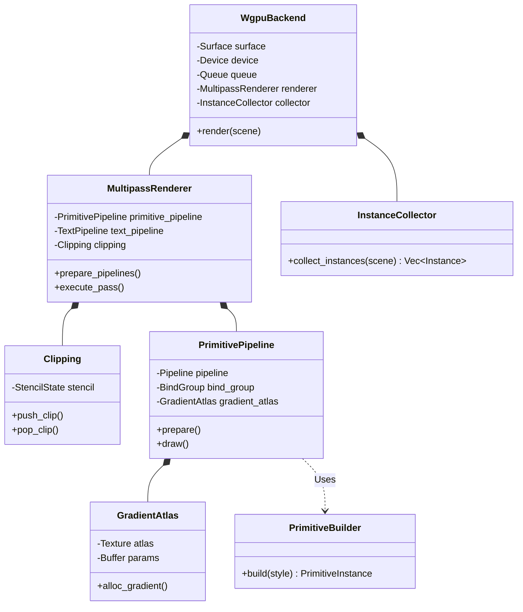

# ADR 0026: Modular WGPU Backend Architecture

**Status:** Accepted

**Date:** 2026-05-18

**Deciders:** Architecture Team, Atlas

## Context

The initial implementation of the `render-engine` crate (as described in [ADR 0004](./0004-wgpu-rendering-backend.md)) relied on a monolithic `WgpuBackend` struct to manage GPU resources, pipeline creation, instance collection, and render pass execution. While sufficient for early prototypes, this design faced significant scaling challenges as the framework matured:

1.  **God Object Pattern**: `WgpuBackend` grew to over 2,700 lines of code, violating the Single Responsibility Principle (SRP). It managed conflicting concerns such as window surface lifecycle, path tessellation, clipping logic, and multipass effect scheduling.
2.  **Duplicated Logic**: The logic for converting `SceneNode` variants into `RectInstance` structures was duplicated between `WgpuBackend` and `arthropod-ecs`, leading to inconsistencies and a "Shotgun Surgery" maintenance burden when adding new node types.
3.  **Pipeline Complexity**: The `PrimitivePipeline` (responsible for rendering rectangles with gradients, borders, and shadows) became a 1,700-line file that mixed data definitions (`PrimitiveInstance`), resource management (`GradientAtlas`), builder logic, and WGPU pipeline configuration.
4.  **Testability**: Unit testing individual components (e.g., just the instance collection logic or gradient atlas management) was impossible without mocking the entire `WgpuBackend`.

## Decision

We have refactored the `render-engine` backend into a modular architecture composed of specialized coordinators and workers. The `WgpuBackend` now acts as a thin facade that orchestrates these components.

### 1. Backend Decomposition

The `WgpuBackend` is split into:

-   **`WgpuBackend` (Coordinator)**: Manages the high-level frame lifecycle (acquire surface, present) and owns the sub-components.
-   **`MultipassRenderer`**: Encapsulates the multipass rendering logic, managing the command encoder, render pass descriptors, and the execution of draw calls for each pipeline. It handles the borrow checker complexity of mutable render pass access.
-   **`InstanceCollector`**: Contains the centralized logic for traversing the `Scene` and generating instances (e.g., `RectInstance`, `GlyphInstance`) from `SceneNode`s. This logic is now shared with `arthropod-ecs` via a public helper.
-   **`Clipping`**: Manages the stencil buffer state and operations for nested clipping rectangles.
-   **`PathInterner`**: Handles the deduplication and tessellation of vector paths.

### 2. Primitive Pipeline Decomposition

The `PrimitivePipeline` is split into four cohesive modules:

-   **`PrimitiveInstance`**: Pure data (POD) struct definitions and bit-flag helpers for the GPU instance data.
-   **`GradientAtlas`**: Manages the gradient texture atlas, upload logic, and bind groups.
-   **`PrimitiveBuilder`**: Pure logic that converts high-level `VisualStyle` into `PrimitiveInstance` data.
-   **`PrimitivePipeline`**: The WGPU pipeline infrastructure (bind group layouts, pipeline state, shader loading).

### Architecture Diagram

## Consequences

### Positive

-   **Separation of Concerns**: Each module has a clear, single responsibility. `PrimitiveBuilder` only handles data conversion; `GradientAtlas` only handles texture management.
-   **Testability**: The `PrimitiveBuilder` and `InstanceCollector` are now pure logic components that can be unit-tested without initializing a WGPU device.
-   **DRY (Don't Repeat Yourself)**: The extraction of `InstanceCollector` logic allows `arthropod-ecs` to reuse the exact same logic for its visibility culling and instance generation, ensuring 100% visual consistency.
-   **Maintainability**: The codebase is easier to navigate. New features (e.g., a new gradient type) only require touching specific files (`GradientAtlas`, `PrimitiveBuilder`) rather than a monolithic backend file.

### Negative

-   **Boilerplate**: The number of files and modules has increased significantly.
-   **Indirection**: Tracing the flow of execution now requires jumping between multiple files (Backend -> Renderer -> Pipeline -> Builder).
-   **API Surface**: More types are now exposed (crate-public) to allow interaction between these modules.

## References

-   Original Architecture: [ADR 0004](./0004-wgpu-rendering-backend.md)
-   Refactoring Logs: `.jules/atlas.md` (Entries 2026-02-07 and 2026-05-18)
