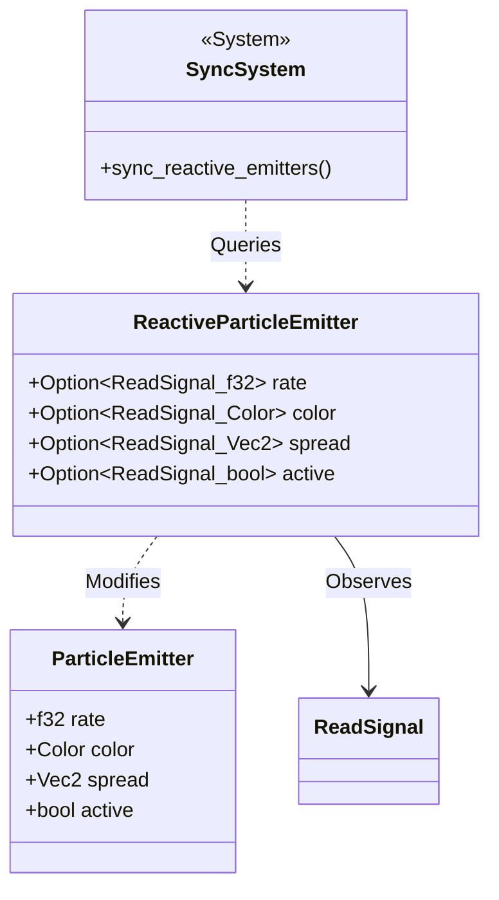

# ADR 0033: Reactive Particle Integration

**Status:** Accepted

**Date:** 2024-05-24

**Deciders:** Codex, Architecture Team

## Context

The initial implementation of the Nova Particle System (ADR 0018) provided a performant way to render thousands of ephemeral entities. However, the properties of `ParticleEmitter` (rate, color, spread) were static or required manual imperative updates via systems.

Arthropod's state management is built around `flux-state` reactive signals. To create dynamic, data-driven visual effects (e.g., a fire effect that grows as a "Heat" signal increases, or sparks that change color based on "Health"), we needed a way to bind particle properties directly to reactive state without writing custom boilerplate systems for every effect.

## Decision

We will implement a `ReactiveParticleEmitter` component in the `arthropod::experimental::reactive_particles` module (guarded by the `nova` feature).

This component acts as a bridge between `flux-state` signals and the `ParticleEmitter` component.

### Architecture



### Mechanism

1.  **Component**: Users attach `ReactiveParticleEmitter` to the same entity as `ParticleEmitter`.
2.  **Binding**: Fields in `ReactiveParticleEmitter` are `Option<ReadSignal<T>>`. If `Some`, the signal is used.
3.  **Synchronization**: A dedicated system, `sync_reactive_emitters`, runs every frame. It checks for updated signals and copies the value from the signal to the corresponding field in `ParticleEmitter`.

### Example Usage

```rust
let (read_heat, write_heat) = Signal::new(runtime, 10.0).split();

commands.spawn((
    ParticleEmitter {
        rate: 10.0,
        ..Default::default()
    },
    ReactiveParticleEmitter {
        rate: Some(read_heat), // Rate will follow the signal
        ..Default::default()
    }
));
```

## Consequences

### Positive

*   **Declarative Effects**: Visual effects can be defined declaratively in relation to application state.
*   **Decoupling**: The particle system logic remains unaware of the specific application logic driving it; it just consumes signals.
*   **Composition**: Works seamlessly with existing `flux-state` primitives (Derived signals, Effects).

### Negative

*   **Performance Overhead**: The `sync_reactive_emitters` system iterates over all reactive emitters every frame and polls signals. While `ReadSignal::get()` is cheap (clone), doing this for many emitters could add overhead. (Mitigation: Emitters are usually few compared to particles).
*   **Input Lag**: Changes in signals propagate to the emitter in the current frame, but particles spawned might only reflect the change in the *next* simulation step depending on system ordering.

## References

*   `crates/arthropod/src/experimental/reactive_particles.rs`
*   ADR 0018: Nova Particle System
*   ADR 0003: Flux State Reactive Model
