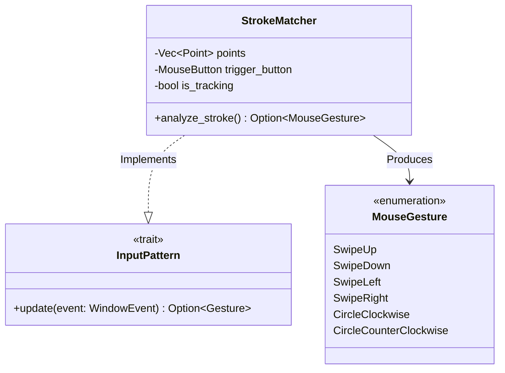

# ADR 0034: Mouse Gesture Recognition

**Status:** Accepted

**Date:** 2024-05-24

**Deciders:** Codex, Architecture Team

## Context

Standard WIMP (Windows, Icons, Menus, Pointer) interfaces rely heavily on point-and-click interactions. However, power users and touch-based interfaces benefit significantly from gesture-based commands (e.g., "Swipe Right" to navigate, "Circle" to reload).

While `input-engine` (ADR 0032) centralized input handling, it lacked native support for recognizing complex geometric paths drawn by the cursor. Implementing this per-widget leads to inconsistent behavior and duplicated logic.

## Decision

We will implement a **Mouse Gesture Recognition** system within `crates/input-engine` as an experimental feature (guarded by `nova`).

### Architecture

The system introduces a `StrokeMatcher` that implements the `InputPattern` trait.



### Algorithm

The `StrokeMatcher` records cursor positions while a specific mouse button (e.g., Right Click) is held down. Upon release, it analyzes the path:

1.  **Geometric Analysis**: Calculates the total winding number (sum of angle changes) to detect loops (Circles).
2.  **Linear Analysis**: Checks displacement vectors to detect linear movements (Swipes).
3.  **Safety**: A strict limit of **1024 points** per gesture is enforced to prevent Denial of Service (DoS) attacks via memory exhaustion from infinite dragging.

### Integration

Applications can use `create_gesture_signal` to bind gesture events to `flux-state` signals, allowing reactive responses to user input.

```rust
let matcher = StrokeMatcher::new(MouseButton::Right);
let gesture_signal = create_gesture_signal(runtime, input_signal, matcher);
```

## Consequences

### Positive

*   **Enhanced UX**: Allows for faster, expert-level interactions.
*   **Reusable Logic**: The recognition algorithm is centralized and available to any widget or application state.
*   **Performance**: Geometric analysis is efficient (O(N) with N < 1024) and only runs on mouse release.

### Negative

*   **Discoverability**: Gestures are invisible; users must learn them. (Requires UI hints).
*   **Conflict**: Gestures may conflict with standard drag-and-drop operations if bound to the same button (e.g., Left Click).

### Risks

*   **False Positives**: Determining the difference between a messy "drag" and a specific "gesture" requires careful tuning of thresholds (distance, closure).
*   **DoS**: Unbounded point collection could crash the application. The 1024-point limit is a critical mitigation.

## References

*   `crates/input-engine/src/mouse_gestures.rs`
*   `crates/input-engine/src/gestures.rs`
*   ADR 0032: Extract Input Engine
