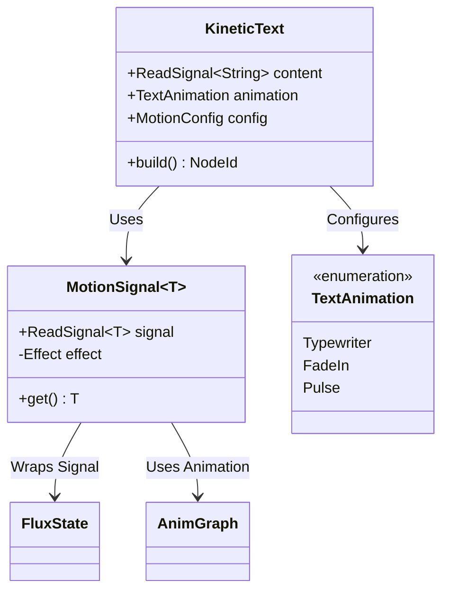

# ADR 0035: Reactive Kinetic Text Widget

**Status:** Proposed

**Date:** 2024-05-22

**Deciders:** Arthropod Core Team

## Context

Modern user interfaces increasingly rely on dynamic text effects (such as typewriter scrolling, fade-ins, and pulsing) to enhance user engagement and provide visual feedback. Currently, implementing these animations in Arthropod requires manual setup of `Animation` loops, `Signal` updates, and `Computed` derivations for each text instance. This process is:

1.  **Repetitive:** The same boilerplate code is written for every animated text element.
2.  **Error-Prone:** Managing the synchronization between the animation clock and the render loop manually can lead to visual glitches or performance issues.
3.  **Inconsistent:** Different implementations may use different easing functions or timing strategies, leading to a disjointed user experience.

We need a standardized, reusable component that encapsulates these common text effects while integrating seamlessly with Arthropod's existing `flux-state` reactivity and `anim-graph` motion systems.

## Decision

We will implement a `KineticText` widget in the `arthropod::experimental` module, guarded by the `nova` feature flag.

### Key Design Points

1.  **Reactive Foundation:** The widget will accept a `ReadSignal<String>` as its content source, allowing the text to change dynamically while preserving the animation state where appropriate.
2.  **Motion System Integration:** We will introduce an internal `MotionSignal` abstraction that combines `flux-state` signals with `anim-graph` animations (Springs and Tweens). This signal will drive the animation progress (e.g., from 0.0 to 1.0) based on a provided or default clock.
3.  **Animation Strategies:**
    *   **Typewriter:** Maps the motion progress to a string slice, revealing characters one by one.
    *   **FadeIn:** Maps the motion progress to the alpha channel of the text color.
    *   **Pulse:** (Planned) Oscillates the color or opacity based on a continuous sine wave.
4.  **Builder API:** The widget will expose a fluent builder API for configuration, matching the style of `widget-core`.
    *   `.animation(TextAnimation::Typewriter)`
    *   `.config(MotionConfig::Spring { ... })`
    *   `.size(24.0)`

### Architecture

## Consequences

### Positive

*   **Reusability:** Developers can add complex text animations with a single widget declaration.
*   **Consistency:** All kinetic text will share the same underlying physics/timing logic, ensuring a uniform feel across the application.
*   **Integration:** Leverages the existing `flux-state` and `anim-graph` crates, proving the extensibility of the architecture.
*   **Declarative:** Fits naturally into the `widget-core` declarative API.

### Negative

*   **Dependencies:** Adds a direct dependency on `anim-graph` to the `arthropod` crate (though it is already a workspace member).
*   **Performance:** The `Typewriter` effect relies on `Computed` signals that re-evaluate every frame during animation. While `flux-state` is efficient, excessive use of heavy computed chains could impact frame times.
*   **Experimental:** As part of the `nova` feature set, the API is subject to change, which might require breaking changes for early adopters.

## Compliance

This ADR follows the "Codex" philosophy of documenting the "Why" and providing clear architectural boundaries via Mermaid diagrams.
