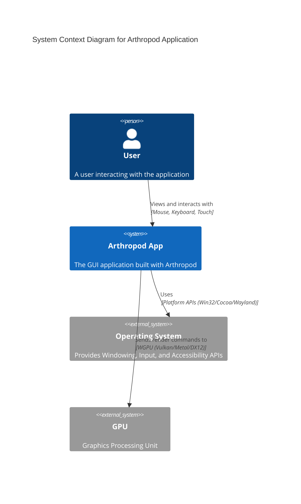
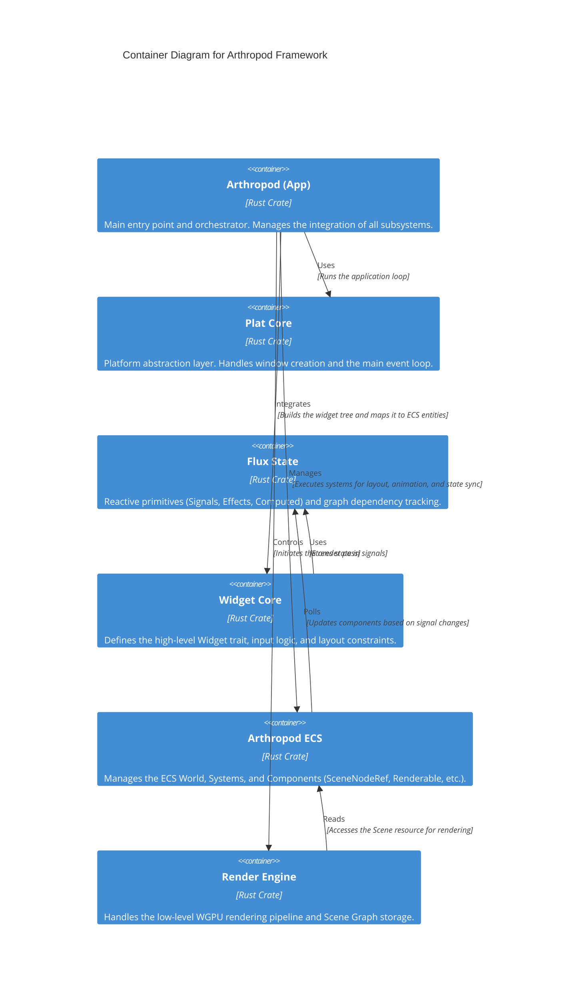
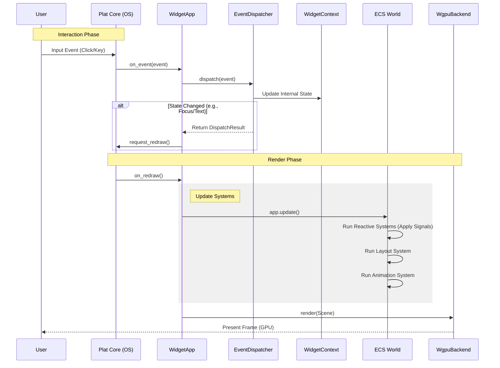

# Arthropod Architecture

This document describes the high-level architecture of the Arthropod framework, focusing on the interactions between the core crates, the reactive state model, and the hybrid ECS runtime.

## System Context

Arthropod is an enterprise-grade, cross-platform GUI framework written in Rust. It sits between the user and the underlying operating system and hardware.

## Container Architecture

The framework is composed of several specialized crates that separate concerns between platform abstraction, rendering, state management, and application logic.

## Runtime Loop (Sequence)

The `WidgetApp` runtime loop orchestrates the flow of events from the OS to the application logic and back to the screen. This sequence diagram illustrates a typical frame update.

## Key Architectural Decisions

- **Hybrid ECS**: We use a custom `Scene` graph (HashMap-based tree) for hierarchical operations (layout, event bubbling) while using `bevy_ecs` for bulk operations (rendering, animation). See [ADR 0001](./adr/0001-hybrid-ecs-architecture.md).
- **Reactive State**: State is managed via `flux-state` signals. The ECS polls these signals to update components, ensuring UI properties remain in sync with the underlying data model.
- **Platform Abstraction**: `plat-core` isolates OS-specific code, allowing the rest of the engine to remain platform-agnostic.
