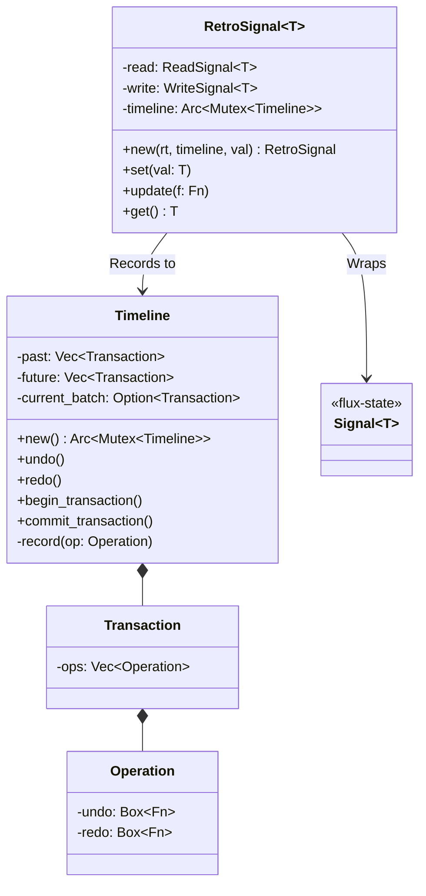
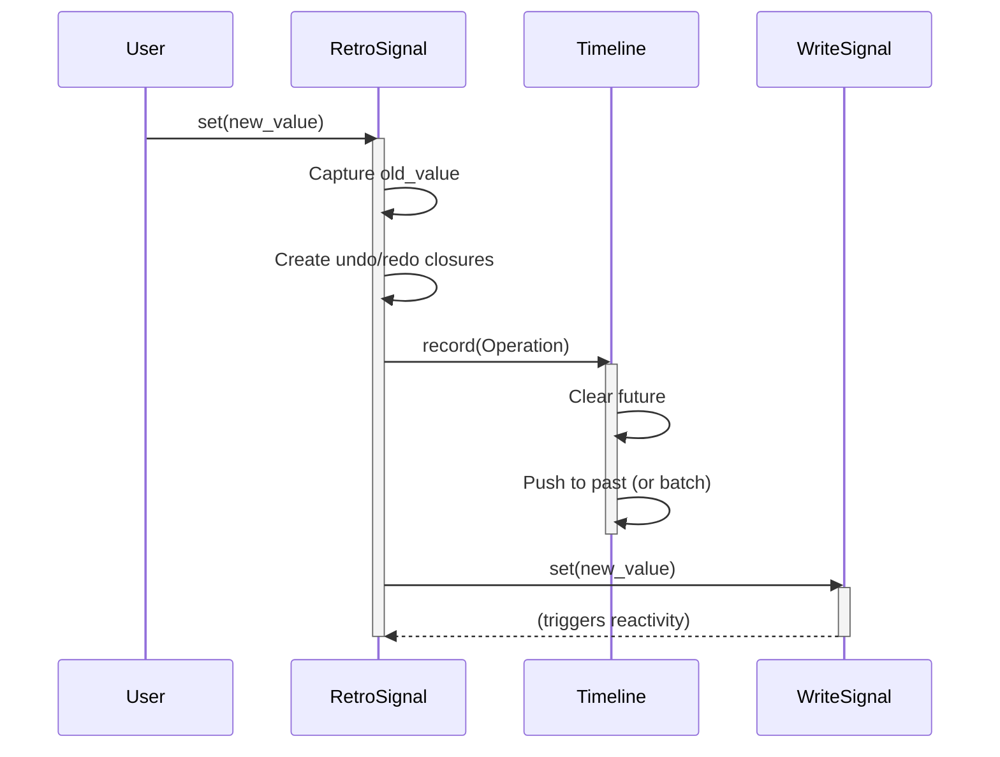
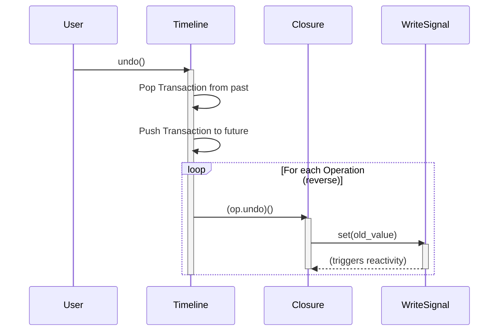

# Chronos Architecture

**Chronos** provides time-travel (undo/redo) capabilities for Arthropod applications by wrapping `flux-state` primitives.

## Class Diagram

## Sequence Diagrams

### Recording a Change

When a `RetroSignal` is updated, it captures the current state and the new state into an `Operation` and pushes it to the `Timeline`.

### Undoing a Change

Undoing pops the last transaction from the history and executes its `undo` closure, which writes the old value back to the underlying signal.

