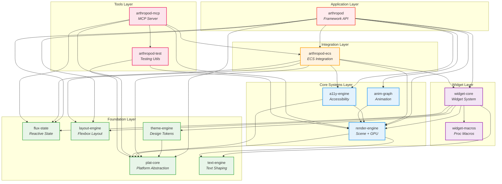

# Arthropod Dependency Graph

This document shows the internal dependency relationships between Arthropod crates.

## Diagram

## Layer Descriptions

| Layer | Crates | Purpose |
|-------|--------|---------|
| **Application** | `arthropod` | High-level framework API for end users |
| **Tools** | `arthropod-mcp`, `arthropod-test` | Developer tooling (MCP server, testing utilities) |
| **Widget** | `widget-core`, `widget-macros` | Widget system and DSL macros |
| **Integration** | `arthropod-ecs` | Bridges ECS with scene graph and reactive state |
| **Core Systems** | `render-engine`, `a11y-engine`, `anim-graph` | GPU rendering, accessibility, animation |
| **Foundation** | `plat-core`, `flux-state`, `layout-engine`, `text-engine`, `theme-engine` | Zero internal dependencies, standalone subsystems |

## Key Observations

1. **Foundation crates have zero internal dependencies** - Makes them easy to test and potentially reusable independently.

2. **`render-engine` is the most depended-upon crate** - 8 other crates depend on it. Changes here ripple widely.

3. **`widget-core` has the widest fan-out** - Pulls from 7 internal crates, integrating nearly every subsystem.

4. **Clear layering** - Dependencies only flow downward.

## Dependency Counts

| Crate | Depends On | Depended By |
|-------|------------|-------------|
| `plat-core` | 0 | 8 |
| `flux-state` | 0 | 4 |
| `layout-engine` | 0 | 3 |
| `text-engine` | 0 | 2 |
| `theme-engine` | 1 | 1 |
| `widget-macros` | 0 | 1 |
| `render-engine` | 2 | 8 |
| `a11y-engine` | 2 | 2 |
| `anim-graph` | 1 | 1 |
| `arthropod-ecs` | 6 | 2 |
| `widget-core` | 6 | 2 |
| `arthropod-test` | 2 | 1 |
| `arthropod-mcp` | 5 | 0 |
| `arthropod` | 8 | 0 |
