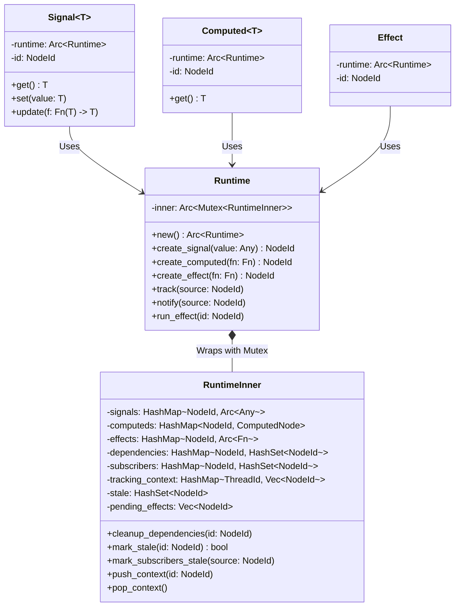
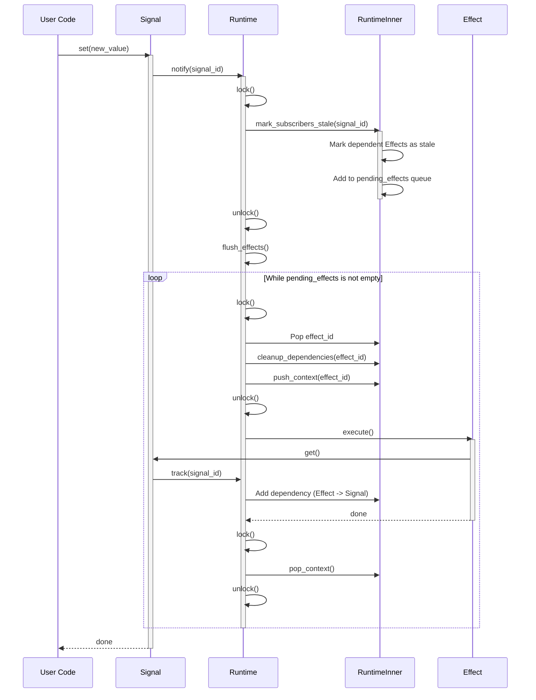

# Flux-State Architecture

This document details the internal architecture of `flux-state`, the reactive state management library for Arthropod.

## Core Architecture

`flux-state` separates the public API (`Runtime`) from the internal implementation (`RuntimeInner`) to ensure thread safety and correct synchronization.

### Class Diagram

## Reactive Update Flow

When a `Signal` is updated, it triggers a chain of notifications through the dependency graph.

### Sequence Diagram: Signal Update

## Thread Safety

-   **Runtime**: Implements `Send + Sync` via `Arc<Mutex<RuntimeInner>>`.
-   **Signals**: Store values as `Arc<dyn Any + Send + Sync>`, ensuring thread-safe access.
-   **Locking Strategy**: Coarse-grained locking around graph operations. Locks are released before executing user callbacks (Effects/Computeds) to prevent deadlocks and allow re-entry into the runtime (e.g., reading other signals).
