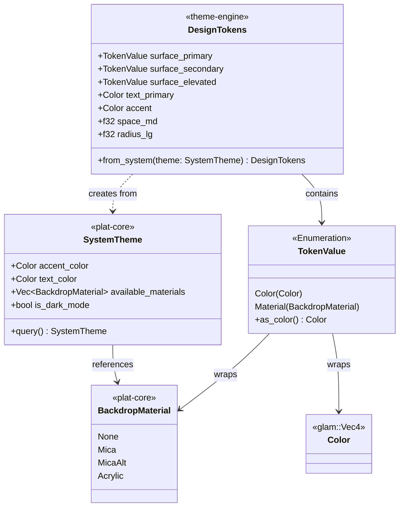
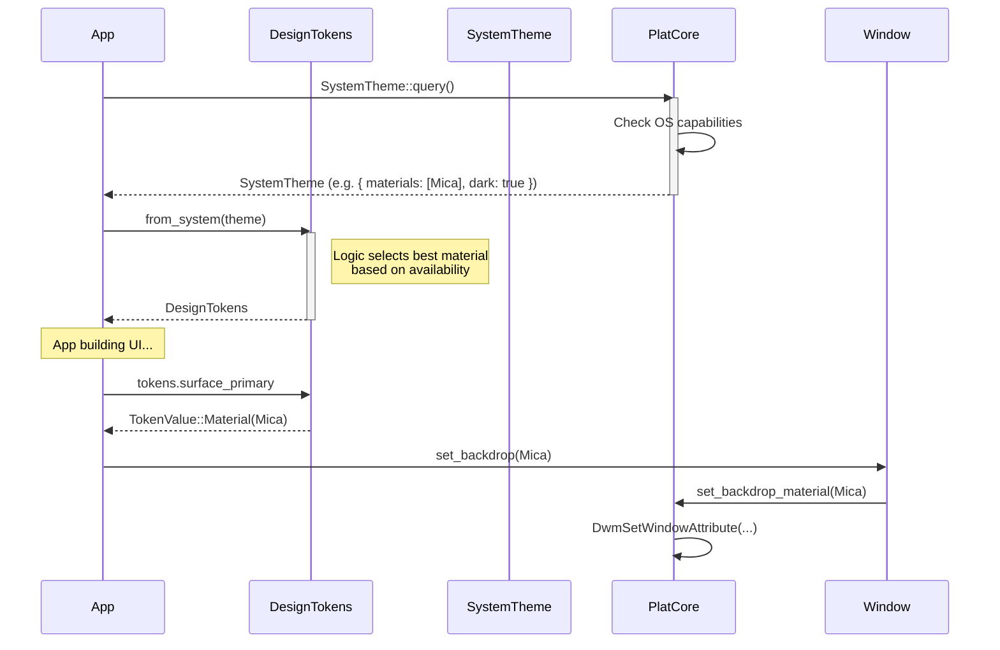

# Theming Architecture

This document details the architecture of the `theme-engine` and its integration with `plat-core` and the widget system.

## Overview

The theming system follows a layered architecture, updated to reflect the simplification in [ADR 0019](../adr/0019-theme-engine-simplification.md).

## Class Structure

The core of the system is the `DesignTokens` struct, which resolves abstract semantic roles (like "Primary Surface") into concrete platform-specific values (like "Mica Material" on Windows, or a specific Color on Linux).

## Style Resolution Flow

This diagram illustrates how a semantic request for "Primary Surface" is resolved to a platform-native effect or a fallback color.

