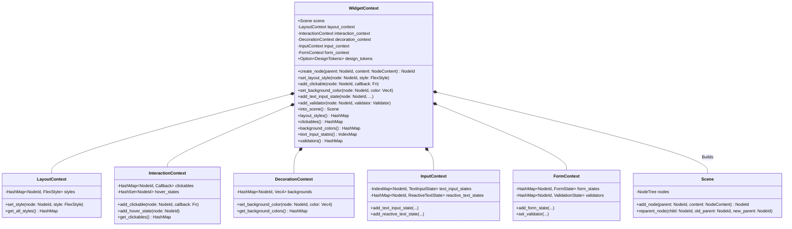
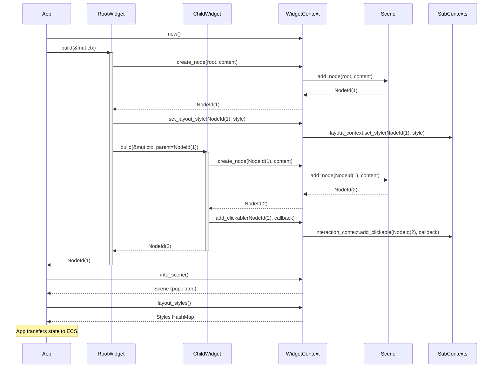

# Widget System Architecture

This document details the architecture of the `widget-core` system, specifically the `WidgetContext` which acts as the central coordinator for building widget hierarchies.

## Widget Context

The `WidgetContext` employs a "Flattened Context" architecture (see [ADR 0014](../adr/0014-flattened-widget-context.md)) to simplify widget implementation while maintaining modularity under the hood.

### Class Diagram

## Widget Build Flow

The process of building a widget involves passing a mutable `WidgetContext` down the tree.

### Sequence Diagram

